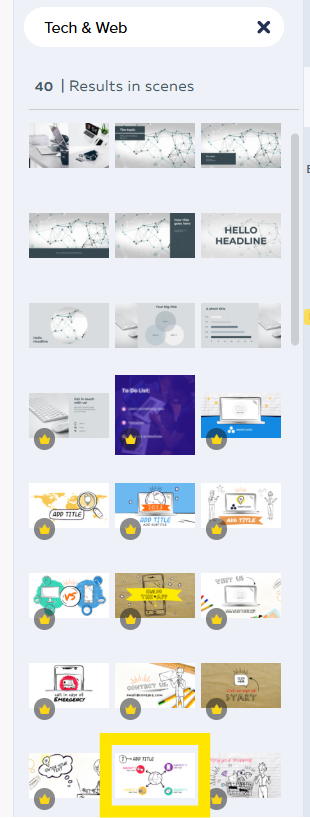
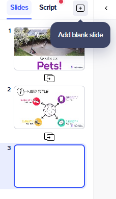
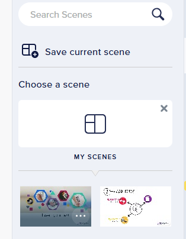

### Activity 2: Starting from a blank template (Customization with Media)

1.	On the left side menu, select **blank**    

2.	At the top of the page, create a new video option will appear. Select **16:9 Horizontal** to create a Slide show presentation size.
3.	It will then ask you to select among options such as “animation, video, whiteboard or cartoon.” For the purpose of this workshop, we will select **Whiteboard**.  
4.	Open Scenes on the right side bar, then Select **Tech and Web** for the scene layout.
5.	Remember that you want to select a **free version** and not a PRO or EDU template (both these options will have a watermark on the background). To find options click **search all looks** and select one with no mini logo on it.For example (see photo).
6. Select a template of your choice and click the **X** on Search bar that says Tech & Web. See images for Scenes chosen in this workshop.   
7.	At the top of the bar under the search option, you should be able to click **save current scene**

8.	Click + sign (on left side) to add more slides and repeat the previous steps. We will start to work with just 2 slides, but feel free to add more.

**Adding media**
9.	Download [this video](http://bit.ly/dsc-goat-video){:target="_blank"} to your computer, or use a video of your own. 
10.	Next, select **Video** and click **upload video**
11. From your downloaded video. Select the video and click **open**.  
12.	 A message will pop up saying **video is longer than slide**, just click **trim video** to make it the same length.
13.	You have successfully uploaded your own media and created your own template. 
14. You can repeat the same steps 9-13 but instead with your own image by clicking **Images** and **Upload Images**. 

**Customize**
- I will remove the shapes on the first slide by dragging my cursor across and clicking the backspace key.
- You can change and add your own **props** by clicking that menu
- You can also modify the text by clicking the textbox and writing **Goats as pets** for example
- Feel free to move objects around objects and modify graphics by clicking on **shapes to remove and the right tool bar to add new shapes, props and textboxes. 
- If you are looking for particular shapes or props use the search bar and type what you are looking for, example search farm in props and find free images or heart in shapes
- You have modified your slide to suit your needs. 

**UPDATE**
[NEXT STEP: Update](update.html){: .btn .btn-blue }

